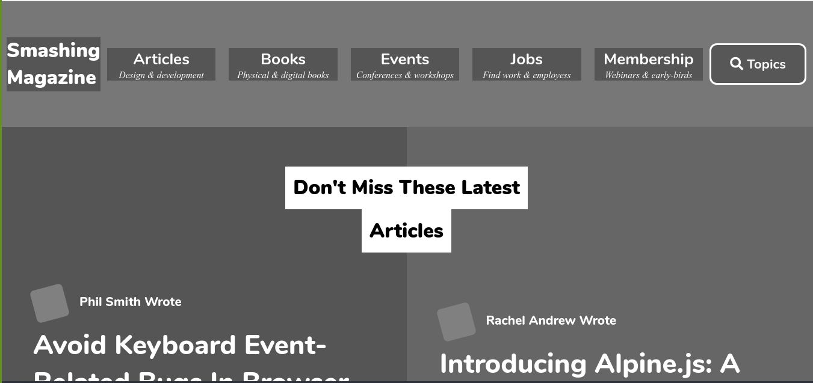
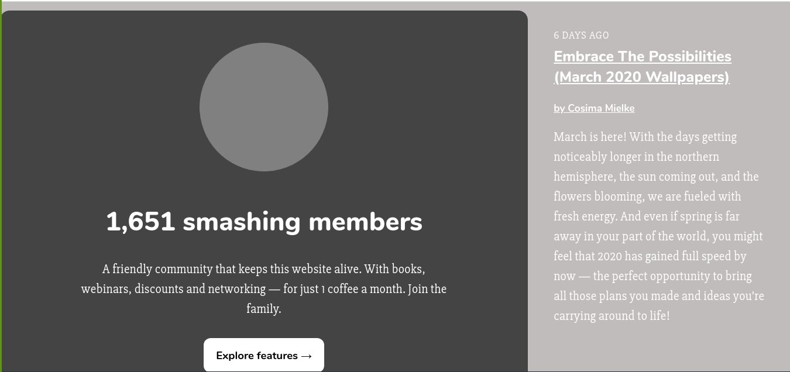

# design-teardown
This is a heatmap focusing on the structure and typography of the smashing magazine website
 
 
 
 

In this project, our aim was to tear down the design of the [smashing magazine](https://www.smashingmagazine.com/) website with a focus on highlighting its overall structure and typography.

There are some elements on this page which are produced with Javascript but our objective in this project wasn't to give this page functionality.

## Built with
  * HTML
  * CSS

## Live demo
[Live Demo Link](https://phillipug.github.io/design-teardown/)

## Getting started

**For this project, you’ll try your best to recreate the smashing magazine web page. The main aim is to ensure the elements get placed and styled roughly the same way as the real page, so functionality is not a priority.**

Use the browser’s developer tools to inspect the real page and understand how elements are placed and styled. 
Build your own page in a .html text file and open it in your browser to check it out.
  - First setup a github repository for your project.
  - Then create a .html file where all your HTML markup will go
  - Create a .css file where all your styling code will reside
  - Then open the youtube web page, inspect its features with your browser's developer tools and start creating  :shipit:

## Author

 :bust_in_silhouette: **Author 1**
 * Github: [@Hermela-Fikre](https://github.com/Hermela-Fikre)
 * Twitter: [@Hermela86529600](https://twitter.com/Hermela86529600)
 * LinkedIn: [hermela-fikre](https://www.linkedin.com/in/hermela-fikre-1a969b156/) 

  :bust_in_silhouette: **Author 2**
 * Github: https://github.com/PhillipUg
 * Twitter: https://twitter.com/Phillip_Ug
 * LinkedIn: https://www.linkedin.com/in/phillip-musiime-74657019a/

## Contributing
Contributions, issues and feature requests are welcome!

   1. Fork the Project
   2. Create your Feature Branch (git checkout -b feature/AmazingFeature)
   3. Commit your Changes (git commit -m 'Add some AmazingFeature')
   4. Push to the Branch (git push origin feature/AmazingFeature)
   5. Open a Pull Request

Feel free to check the [issues page](https://github.com/phillipug/design-teardown/issues).

## Show your support
Give a :star: if you like this project!

## Acknowledgements
  * [Microverse](https://www.microverse.org/)
  * [The Odin Project](https://www.theodinproject.com/courses/html5-and-css3/lessons/embedding-images-and-video#introduction)

## License
 Distributed under the MIT License.
